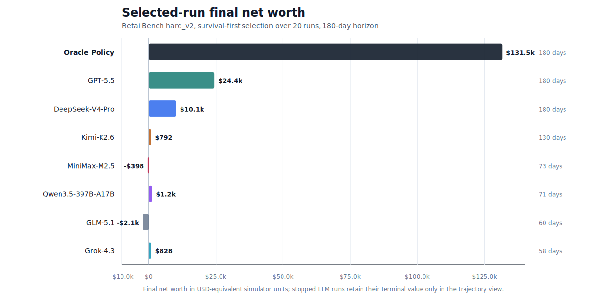
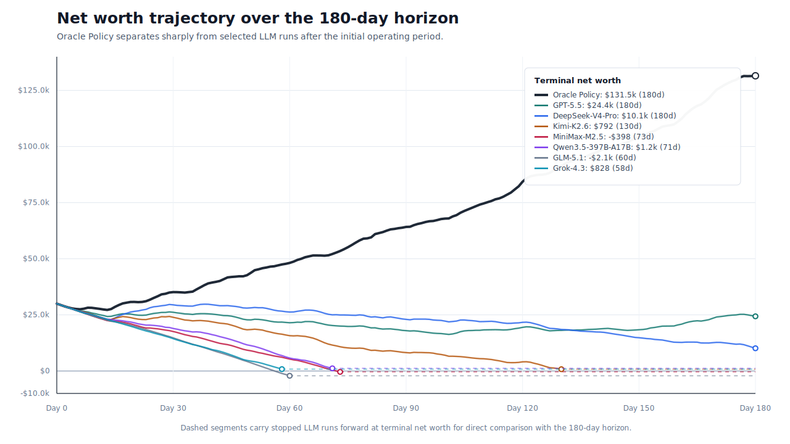

# RetailBench

[](LICENSE)
[](https://www.python.org/downloads/)
[](https://arxiv.org/abs/2603.16453)
[](https://github.com/Ice-Moon-28/RetailBench)

RetailBench is a long-horizon benchmark for evaluating tool-using LLM agents in
retail operations. It turns single-store supermarket management into an
interactive decision-making problem where agents must acquire evidence, manage
inventory, choose suppliers, set prices, and adapt to delayed business feedback
over extended episodes.

## Links

| Resource | Link |
| --- | --- |
| Paper | [arXiv:2603.16453](https://arxiv.org/abs/2603.16453) |
| Code | [github.com/Ice-Moon-28/RetailBench](https://github.com/Ice-Moon-28/RetailBench) |
| Benchmark homepage | [`docs/index.html`](docs/index.html) |
| Release notes | [`RELEASE.md`](RELEASE.md) |
| Citation metadata | [`CITATION.cff`](CITATION.cff) |

## What Is RetailBench?

Most tool-use benchmarks evaluate short tasks with immediate feedback.
RetailBench instead studies whether agents can sustain coherent operational
policies under delayed consequences. In each episode, an agent observes the
store through tools, decides what additional evidence to inspect, takes
state-changing actions, and receives feedback through sales, returns, reviews,
inventory aging, supplier dynamics, and cash-flow changes.

The benchmark is designed to expose failures that are hard to see in static
question answering or short web tasks:

- incomplete product-space coverage;
- shallow or misdirected evidence acquisition;
- invalid pricing, replenishment, or supplier actions;
- weak follow-up after delayed operational consequences;
- unstable long-horizon tradeoffs between sales, inventory, returns, and net
  worth.

## Benchmark Scope

RetailBench models supermarket operation as a partially observable interactive
process. The released benchmark includes:

- SKU-level assortment and product demand;
- supplier availability, lead time, quality, and cost differences;
- inventory capacity, replenishment, spoilage, and stockouts;
- price changes, sales, returns, funds, and net worth;
- customer reviews and external news events;
- tool interfaces for state inspection and business actions;
- LLM-agent runners for ReAct, Reflection, and Plan-and-Act style scaffolds;
- a non-LLM reference policy for contextualizing the remaining performance gap.

The non-LLM policy is an oracle-style reference, not a fair language-agent
baseline. It is included to show how far current LLM agents remain from a
privileged policy with structured access to the task.

## Benchmark Results

The public result package reports a survival-first selected-run analysis over
seven LLMs and 20 rollout runs in the `hard_v2` setting.

| Item | Value |
| --- | --- |
| Environment | `hard_v2` |
| Evaluation horizon | 180 days |
| LLM models | 7 |
| Rollout runs | 20 |
| Agent frameworks | `react`, `reflection`, `plan_and_act` |
| Selection rule | maximize `run_days`, then `final_networth`, then `total_sales` |

### Selected-Run Leaderboard



| Policy / model | Framework | Days | Final net worth | Total sales | Net-worth gap to Oracle |
| --- | --- | ---: | ---: | ---: | ---: |
| Oracle Policy | `quality_based` | 180 | $131.5k | 267,998 | $0.0k |
| GPT-5.5 | `react` | 180 | $24.4k | 136,405 | $107.2k |
| DeepSeek-V4-Pro | `plan_and_act` | 180 | $10.1k | 164,417 | $121.4k |
| Kimi-K2.6 | `react` | 130 | $0.8k | 86,214 | $130.7k |
| MiniMax-M2.5 | `plan_and_act` | 73 | -$0.4k | 23,521 | $131.9k |
| Qwen3.5-397B-A17B | `reflection` | 71 | $1.2k | 35,622 | $130.3k |
| GLM-5.1 | `react` | 60 | -$2.1k | 7,016 | $133.6k |
| Grok-4.3 | `react` | 58 | $0.8k | 11,305 | $130.7k |

The Oracle Policy is the non-LLM heuristic reference used to contextualize the
remaining long-horizon gap. It is not intended as a fair language-agent
baseline.

### Net-Worth Trajectory



The trajectory view shows that the strongest selected LLM runs can survive the
full 180-day horizon, but they still remain far below the Oracle Policy in
terminal net worth. Runs that stop early are carried forward at terminal net
worth only for visual comparison with the full horizon.

The benchmark homepage provides the same results as an interactive static page,
including sortable tables and all-run diagnostic figures. The underlying static
data is stored in:

- [`docs/assets/benchmark_results.json`](docs/assets/benchmark_results.json)
- [`paper_submit_data/outputs/best_framework_by_model.csv`](paper_submit_data/outputs/best_framework_by_model.csv)
- [`paper_submit_data/outputs/four_stage_metrics.csv`](paper_submit_data/outputs/four_stage_metrics.csv)

## Installation

```bash
git clone https://github.com/Ice-Moon-28/RetailBench.git
cd RetailBench

python3 -m venv .venv
source .venv/bin/activate
pip install -r requirements.txt
```

Run a short simulator check:

```bash
python3 retail_environment.py --mode tools --config-type middle
```

## Running Agents

Run the non-LLM reference policy:

```bash
python3 agents/run_non_llm_simulation.py --days 30 --config-type hard_v2
```

LLM-agent runs require provider credentials. Pass credentials through
environment variables or command-line arguments. Do not write API keys into
source files.

```bash
python3 agents/run_react.py \
  --model qwen-plus \
  --config_type middle \
  --max_days 30 \
  --api_key "$OPENAI_API_KEY" \
  --base_url "$OPENAI_BASE_URL"
```

## Reproducing Paper-Facing Artifacts

Regenerate the main metric report and selected-run table:

```bash
python3 paper_submit_data/analyze_metrics.py \
  --manifest paper_submit_data/manifest.json \
  --output-dir paper_submit_data/outputs
```

Regenerate four-stage diagnostic results:

```bash
python3 paper_submit_data/analyze_four_stage_metrics.py
python3 paper_submit_data/render_four_stage_report.py
```

The full LLM rollout logs are large and may not be redistributed with every
release package. The checked-in CSV/JSON outputs are sufficient to inspect the
paper-facing tables, static homepage, and diagnostic figures.

## Benchmark Homepage

The static benchmark homepage is located in [`docs/`](docs/). It can be opened
directly:

```text
docs/index.html
```

or served locally:

```bash
python3 -m http.server 8000 --directory docs
```

Then open `http://localhost:8000`.

## Repository Layout

```text
RetailBench/
  retail_environment.py        core simulator entry point
  module/                      retail business modules
  agents/                      LLM and non-LLM agent runners
  model/                       review, return-rate, and SKU models
  util/                        configuration and logging utilities
  paper_submit_data/           paper-facing metrics and diagnostics
  paper/                       manuscript sources and submission package
  release/anonymous_artifact/  curated reproducibility package
  docs/                        static benchmark homepage
```

## Citation

```bibtex
@misc{zhang2026retailbench,
  title = {RetailBench: Evaluating Long-Horizon Autonomous Decision-Making and Strategy Stability of LLM Agents in Realistic Retail Environments},
  author = {Zhang, Linghua and Wang, Jun and Wu, Jingtong and Zhang, Zhisong},
  year = {2026},
  eprint = {2603.16453},
  archivePrefix = {arXiv},
  primaryClass = {cs.AI},
  doi = {10.48550/arXiv.2603.16453},
  url = {https://arxiv.org/abs/2603.16453}
}
```

## License

RetailBench is released under the [MIT License](LICENSE).
