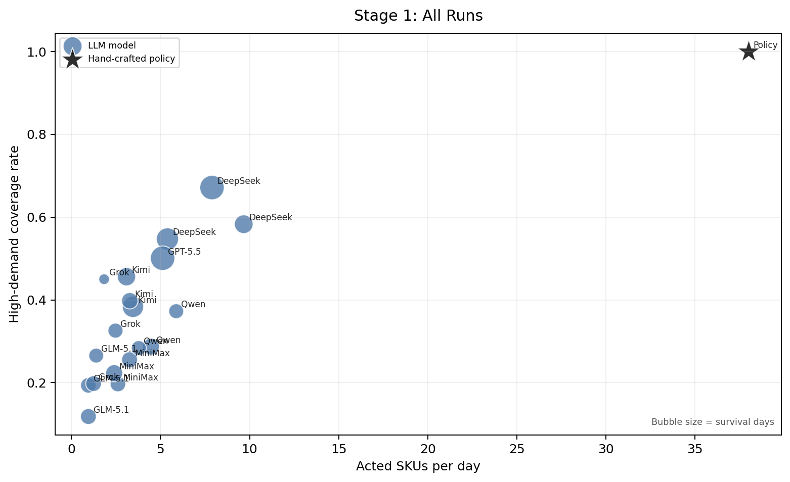
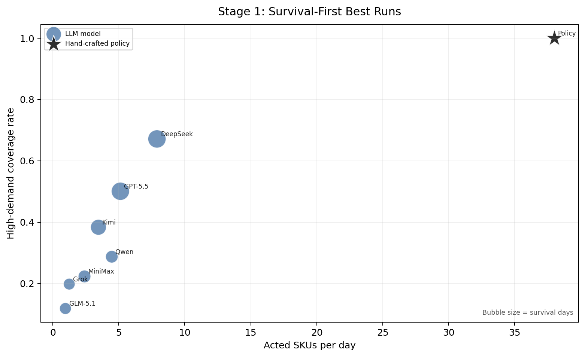
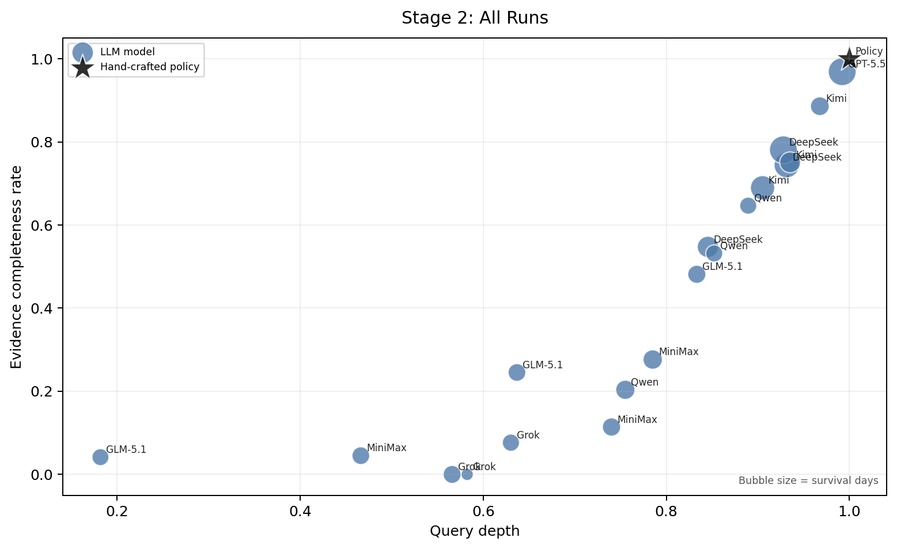
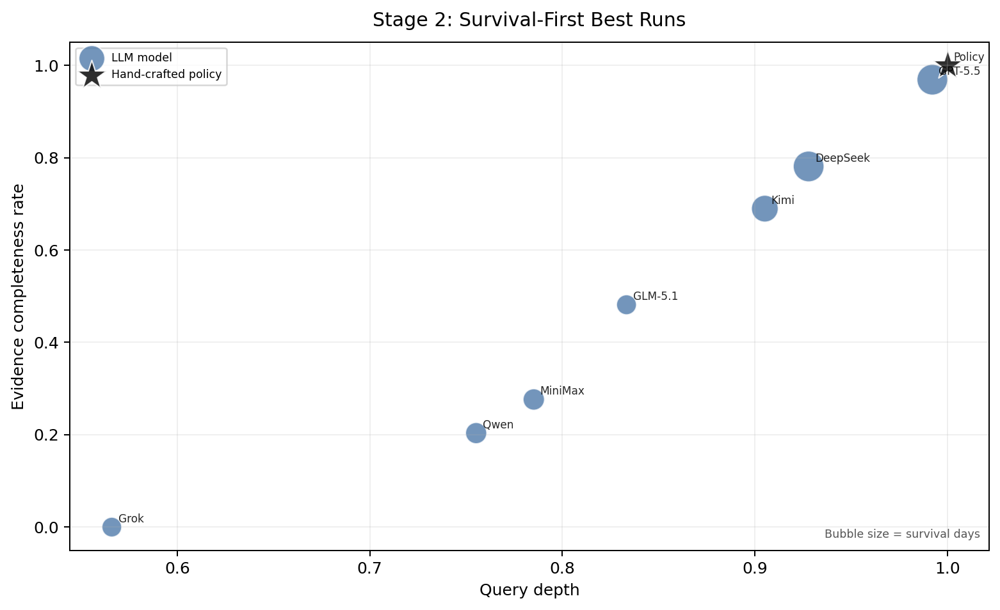
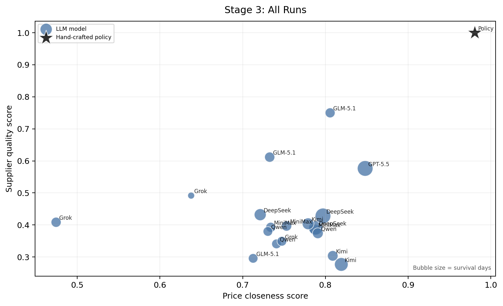
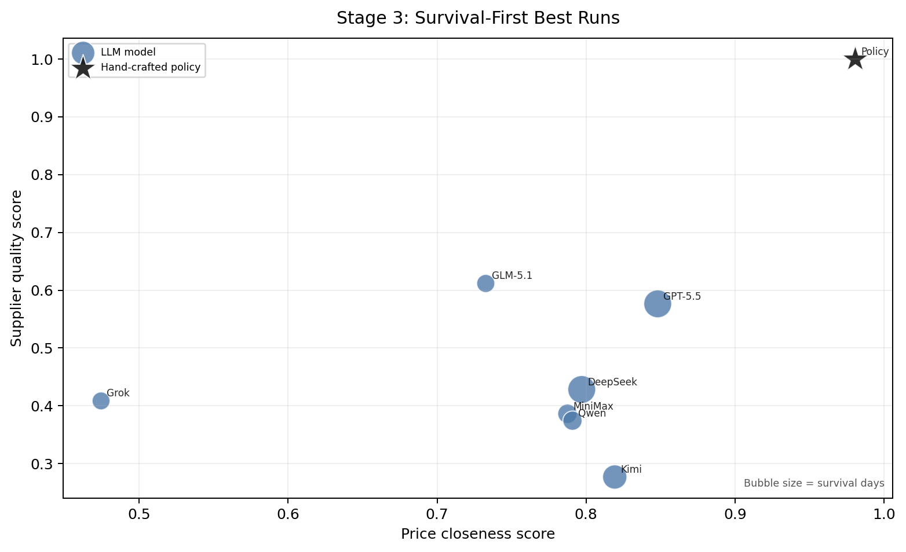
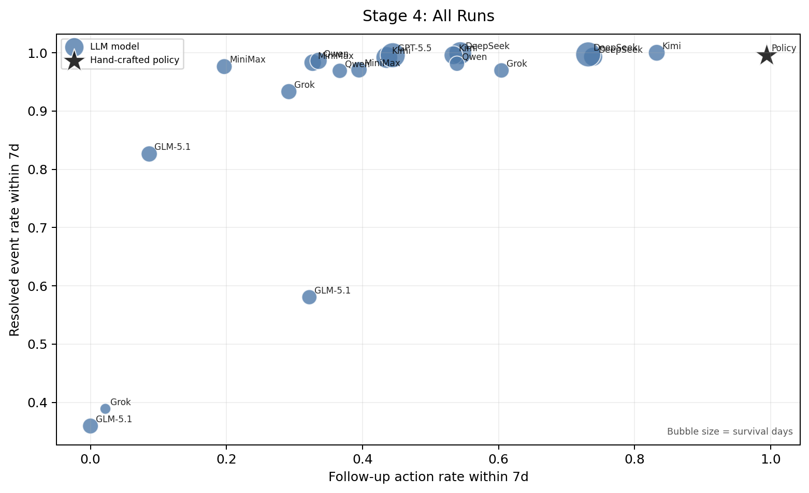
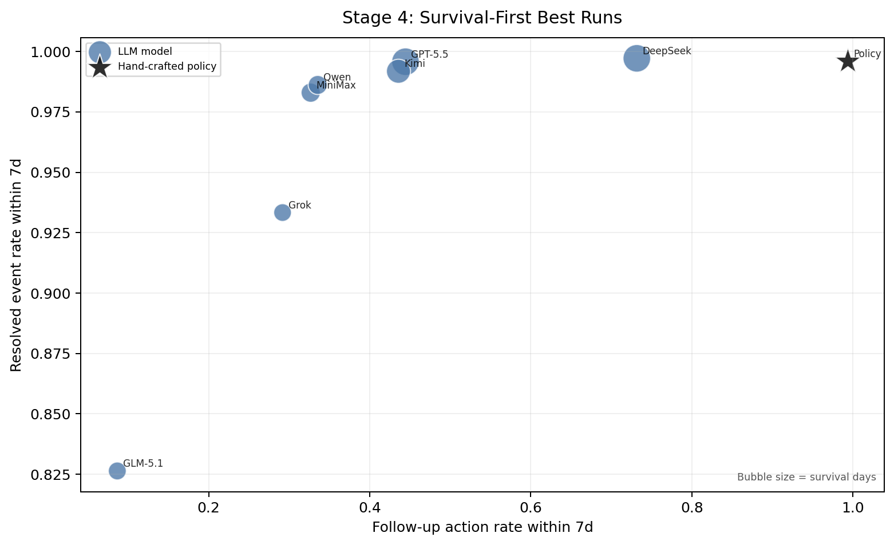

# RetailBench Four-Stage Run Analysis

## Scope

本报告覆盖 `20` 个 runs：`19` 个 LLM runs 和 `1` 个 Non-LLM run。分析单位是 run；全量图展示每个 run，best-run 图只保留每个模型 survival day 最多的 run。

Non-LLM Heuristic 是显式规则 policy；Stage 2 展示中将其 evidence depth 和 completeness 记为 1，因为规则已经完整指定了所需证据，而不是通过自然语言工具查询逐项获取。所有 retrospective metrics 只用于诊断，不声称 agent 当时可以看到未来销量。

## Executive Summary

- 四阶段分析把失败拆成：选 SKU、查证据、转动作、长期跟踪。任何一层失败都会放大到 survival、networth 和 sales 差距。
- 当前数据最强的瓶颈是 Stage 3：很多 run 的 query depth 很高，但 action correction 仍低，说明问题不只是工具调用不足。
- Non-LLM gap 的核心不是语言能力，而是它有显式、稳定、状态化的 SKU coverage、supplier selection 和 follow-up policy。

## Stage 1: SKU Candidate Selection

### 数据分析逻辑

- 这一阶段问的是：模型每天是否先选对应该关注的 SKU。如果重要 SKU 没进入候选集合，后面的 query、订货、调价都不会发生。
- `Acted SKUs/day` 衡量管理覆盖面；`Missed high-demand rate` 用每日 sales top-10 加 stockout SKU 作为事后 high-demand signal，检查过去 3 天至当天是否被 action 覆盖。
- `Action->Sales7d` 检查被 action 的 SKU 在 7 天内是否真的产生销售；`Top10 share` 和 HHI 衡量动作是否过度集中在少数 SKU。
- 图的读法：理想点位在右上角：覆盖 SKU 多，同时 high-demand coverage 高。

### 图表 1：全量 runs

- 全量 runs：`Acted SKUs per day` 范围为 0.9464 - 38, mean 5.3551；`Missed high-demand rate` 范围为 0 - 0.8818, mean 0.6146。
- 全量数据中 `Acted SKUs per day` 最高的是 Policy，值为 38；`Missed high-demand rate` 最高的是 GLM-5.1，值为 0.8818。

| Model | Framework | Days | Acted/day | MissHD | Action->Sales7d | Top10 share |
| --- | --- | --- | --- | --- | --- | --- |
| MiniMax-M2.5 | react | 61 | 3.2623 | 0.7447 | 0.9211 | 0.4430 |
| MiniMax-M2.5 | reflection | 56 | 2.6071 | 0.8033 | 0.5082 | 0.4836 |
| MiniMax-M2.5 | plan_and_act | 73 | 2.3973 | 0.7771 | 0.9296 | 0.5477 |
| DeepSeek-V4-Pro | react | 144 | 5.3889 | 0.4527 | 0.9163 | 0.3267 |
| DeepSeek-V4-Pro | reflection | 94 | 9.6702 | 0.4171 | 0.9446 | 0.2853 |
| DeepSeek-V4-Pro | plan_and_act | 180 | 7.8889 | 0.3286 | 0.9627 | 0.3213 |
| GLM-5.1 | react | 60 | 0.9500 | 0.8818 | 0.8642 | 0.5679 |
| GLM-5.1 | reflection | 49 | 1.3878 | 0.7346 | 0.9170 | 0.8824 |
| GLM-5.1 | plan_and_act | 56 | 0.9464 | 0.8065 | 0.3585 | 0.3774 |
| Kimi-K2.6 | react | 130 | 3.4538 | 0.6167 | 0.9683 | 0.3827 |
| Kimi-K2.6 | reflection | 66 | 3.2727 | 0.6020 | 0.9871 | 0.7919 |
| Kimi-K2.6 | plan_and_act | 89 | 3.0899 | 0.5439 | 0.9073 | 0.5304 |
| Qwen3.5-397B-A17B | react | 50 | 5.8800 | 0.6273 | 0.8529 | 0.3643 |
| Qwen3.5-397B-A17B | reflection | 71 | 4.4648 | 0.7129 | 0.8533 | 0.2874 |
| Qwen3.5-397B-A17B | plan_and_act | 50 | 3.7800 | 0.7164 | 0.9634 | 0.6616 |
| Grok-4.3 | react | 58 | 1.2414 | 0.8022 | 0.9722 | 0.6944 |
| Grok-4.3 | reflection | 51 | 2.4706 | 0.6742 | 0.9722 | 0.7500 |
| Grok-4.3 | plan_and_act | 12 | 1.8333 | 0.5500 | 0.7143 | 0.8791 |
| GPT-5.5 | react | 180 | 5.1167 | 0.4993 | 0.9245 | 0.3245 |
| Non-LLM Heuristic | quality_based | 180 | 38 | 0 | 0.9994 | 0.2730 |

### 图表 2：Survival-first best runs

- Survival-first best runs：`Acted SKUs per day` 范围为 0.9500 - 38, mean 7.9391；`Missed high-demand rate` 范围为 0 - 0.8818, mean 0.5773。
- best-run 图用于回答：如果每个模型只保留 survival day 最多的 run，模型间差异是否仍然存在。该视角避免短命高 networth run 混淆长期经营能力。
- 在 selected 视角下，代表性长生存 run 包括 DeepSeek，survival days 为 180。

| Model | Framework | Days | Acted/day | MissHD | Action->Sales7d | Top10 share |
| --- | --- | --- | --- | --- | --- | --- |
| DeepSeek-V4-Pro | plan_and_act | 180 | 7.8889 | 0.3286 | 0.9627 | 0.3213 |
| GLM-5.1 | react | 60 | 0.9500 | 0.8818 | 0.8642 | 0.5679 |
| GPT-5.5 | react | 180 | 5.1167 | 0.4993 | 0.9245 | 0.3245 |
| Grok-4.3 | react | 58 | 1.2414 | 0.8022 | 0.9722 | 0.6944 |
| Kimi-K2.6 | react | 130 | 3.4538 | 0.6167 | 0.9683 | 0.3827 |
| MiniMax-M2.5 | plan_and_act | 73 | 2.3973 | 0.7771 | 0.9296 | 0.5477 |
| Qwen3.5-397B-A17B | reflection | 71 | 4.4648 | 0.7129 | 0.8533 | 0.2874 |
| Non-LLM Heuristic | quality_based | 180 | 38 | 0 | 0.9994 | 0.2730 |

## Stage 2: Evidence Acquisition

### 数据分析逻辑

- 这一阶段问的是：模型在 action 前是否查到了足够、相关、同 SKU 的证据。
- 对每个已执行 action，只看同一天 action 之前的 query，并把 query 映射到 inventory、sales history、supplier prices、supplier return/rating、current price、cost 等 required evidence categories。
- `QDepth` 是 required categories 命中比例；`Evidence match` 要求 query 覆盖同 SKU 或全局上下文；`Missing critical` 表示至少一个 required evidence category 缺失。
- 图的读法：理想点位在右上角：query depth 高，同时 evidence completeness 高。

### 图表 1：全量 runs

- 全量 runs：`Query depth` 范围为 0.1817 - 1, mean 0.7712；`Missing critical evidence rate` 范围为 0 - 1, mean 0.5485。
- 全量数据中 `Query depth` 最高的是 Policy，值为 1；`Missing critical evidence rate` 最高的是 Grok，值为 1。

| Model | Framework | Days | QDepth | Order QDepth | Price QDepth | Missing critical |
| --- | --- | --- | --- | --- | --- | --- |
| MiniMax-M2.5 | react | 61 | 0.7401 | 0.7362 | 0.8250 | 0.8860 |
| MiniMax-M2.5 | reflection | 56 | 0.4662 | 0.6026 | 0.2244 | 0.9549 |
| MiniMax-M2.5 | plan_and_act | 73 | 0.7852 | 0.7809 | 0.8214 | 0.7236 |
| DeepSeek-V4-Pro | react | 144 | 0.9316 | 0.9294 | 0.9350 | 0.2559 |
| DeepSeek-V4-Pro | reflection | 94 | 0.8455 | 0.8271 | 0.8658 | 0.4526 |
| DeepSeek-V4-Pro | plan_and_act | 180 | 0.9279 | 0.9628 | 0.8906 | 0.2190 |
| GLM-5.1 | react | 60 | 0.8333 | 0.7819 | 0.9044 | 0.5185 |
| GLM-5.1 | reflection | 49 | 0.1817 | 0.5213 | 0.0471 | 0.9585 |
| GLM-5.1 | plan_and_act | 56 | 0.6368 | 0.6300 | 0.7500 | 0.7547 |
| Kimi-K2.6 | react | 130 | 0.9052 | 0.8853 | 0.9323 | 0.3104 |
| Kimi-K2.6 | reflection | 66 | 0.9678 | 0.8869 | 0.9922 | 0.1142 |
| Kimi-K2.6 | plan_and_act | 89 | 0.9353 | 0.9344 | 0.9366 | 0.2492 |
| Qwen3.5-397B-A17B | react | 50 | 0.8524 | 0.8849 | 0.7908 | 0.4683 |
| Qwen3.5-397B-A17B | reflection | 71 | 0.7552 | 0.7562 | 0.7321 | 0.7964 |
| Qwen3.5-397B-A17B | plan_and_act | 50 | 0.8895 | 0.9602 | 0.8258 | 0.3534 |
| Grok-4.3 | react | 58 | 0.5660 | 0.5704 | 0.2500 | 1 |
| Grok-4.3 | reflection | 51 | 0.6302 | 0.5927 | 0.7857 | 0.9236 |
| Grok-4.3 | plan_and_act | 12 | 0.5824 | 0.6333 | 0.4839 | 1 |
| GPT-5.5 | react | 180 | 0.9922 | 0.9901 | 1 | 0.0311 |
| Non-LLM Heuristic | quality_based | 180 | 1 | 1 | 1 | 0 |

### 图表 2：Survival-first best runs

- Survival-first best runs：`Query depth` 范围为 0.5660 - 1, mean 0.8456；`Missing critical evidence rate` 范围为 0 - 1, mean 0.4499。
- best-run 图用于回答：如果每个模型只保留 survival day 最多的 run，模型间差异是否仍然存在。该视角避免短命高 networth run 混淆长期经营能力。
- 在 selected 视角下，代表性长生存 run 包括 DeepSeek，survival days 为 180。

| Model | Framework | Days | QDepth | Order QDepth | Price QDepth | Missing critical |
| --- | --- | --- | --- | --- | --- | --- |
| DeepSeek-V4-Pro | plan_and_act | 180 | 0.9279 | 0.9628 | 0.8906 | 0.2190 |
| GLM-5.1 | react | 60 | 0.8333 | 0.7819 | 0.9044 | 0.5185 |
| GPT-5.5 | react | 180 | 0.9922 | 0.9901 | 1 | 0.0311 |
| Grok-4.3 | react | 58 | 0.5660 | 0.5704 | 0.2500 | 1 |
| Kimi-K2.6 | react | 130 | 0.9052 | 0.8853 | 0.9323 | 0.3104 |
| MiniMax-M2.5 | plan_and_act | 73 | 0.7852 | 0.7809 | 0.8214 | 0.7236 |
| Qwen3.5-397B-A17B | reflection | 71 | 0.7552 | 0.7562 | 0.7321 | 0.7964 |
| Non-LLM Heuristic | quality_based | 180 | 1 | 1 | 1 | 0 |

## Stage 3: Action Conversion

### 数据分析逻辑

- 这一阶段问的是：模型能否把证据转成正确 supplier、quantity 和 price，而不是只会查信息。
- 价格分析：对 `modify_sku_price`，用历史销量与当前可见成本估计 optimal price，报告模型 new price 到 optimal price 的 mean/median/p90 percent distance，并拆分高于/低于 optimal 的比例。
- Supplier rank 分析：对每个 `place_order`，在同一 SKU/date 的候选 supplier 中计算 selected supplier 的 price rank 和 raw quality rank；rank=1 分别表示 cheapest supplier 或 highest-quality supplier。
- `PriceFirst%` 是 selected supplier 为 cheapest supplier 的比例；`QualityFirst%` 是 selected supplier 为 raw quality rank-1 的比例。二者一起判断模型是在按低价选 supplier，还是按质量选 supplier。
- 图的读法：理想点位在右上角：price closeness 高，同时 supplier quality score 高。

### 图表 1：全量 runs

- 全量 runs：`Mean price distance to optimal (%)` 范围为 1.9841 - 110.7926, mean 34.0828；`Mean supplier quality rank (1=best)` 范围为 1 - 3.8930, mean 3.2023。
- 全量数据中价格最接近 optimal 的是 Policy，mean distance 为 1.9841%；supplier quality rank 最好的是 Policy，平均 rank 为 1；价格距离最大的是 Grok，mean distance 为 110.7926%。

| Model | Framework | Days | ActionCorr | PriceDistMean% | PriceDistP90% | AboveOpt% | BelowOpt% | QRank | PriceRank | PriceFirst% | QualityFirst% |
| --- | --- | --- | --- | --- | --- | --- | --- | --- | --- | --- | --- |
| MiniMax-M2.5 | react | 61 | 0.1447 | 32.7990 | 54.4242 | 0.1000 | 0.9000 | 3.4128 | 2.0138 | 0.5688 | 0.1972 |
| MiniMax-M2.5 | reflection | 56 | 0.1148 | 36.2566 | 50.9221 | 0.1477 | 0.8523 | 3.4295 | 2.0897 | 0.5256 | 0.1859 |
| MiniMax-M2.5 | plan_and_act | 73 | 0.1759 | 26.9893 | 67.6428 | 0.4286 | 0.5714 | 3.4551 | 1.9494 | 0.5899 | 0.1404 |
| DeepSeek-V4-Pro | react | 144 | 0.2201 | 26.8556 | 57.8156 | 0.3312 | 0.6592 | 3.4371 | 1.6789 | 0.5706 | 0.1915 |
| DeepSeek-V4-Pro | reflection | 94 | 0.1807 | 38.6649 | 80.8463 | 0.5610 | 0.4368 | 3.2717 | 1.9653 | 0.5106 | 0.2370 |
| DeepSeek-V4-Pro | plan_and_act | 180 | 0.2705 | 25.4611 | 54.6875 | 0.3303 | 0.6411 | 3.2872 | 1.6663 | 0.5570 | 0.2326 |
| GLM-5.1 | react | 60 | 0.1646 | 36.4941 | 81.8707 | 0.6875 | 0.3125 | 2.5532 | 3.2340 | 0.1702 | 0.3191 |
| GLM-5.1 | reflection | 49 | 0.2595 | 40.3257 | 75.9562 | 0.9227 | 0.0725 | 3.8171 | 1.4878 | 0.6707 | 0.1098 |
| GLM-5.1 | plan_and_act | 56 | 0.2830 | 24.1145 | 44.5923 | 0.3333 | 0.6667 | 2 | 2.8000 | 0.1200 | 0.5600 |
| Kimi-K2.6 | react | 130 | 0.2453 | 22.0675 | 46.8535 | 0.4450 | 0.5550 | 3.8930 | 1.2813 | 0.8135 | 0.1254 |
| Kimi-K2.6 | reflection | 66 | 0.1109 | 23.6262 | 38.9528 | 0.7890 | 0.2086 | 3.7857 | 1.2619 | 0.8175 | 0.1825 |
| Kimi-K2.6 | plan_and_act | 89 | 0.1581 | 28.3540 | 53.6686 | 0.2519 | 0.7405 | 3.3855 | 1.6872 | 0.5531 | 0.1676 |
| Qwen3.5-397B-A17B | react | 50 | 0.1429 | 36.9024 | 64.4139 | 0.1053 | 0.8947 | 3.4810 | 1.8235 | 0.6540 | 0.1315 |
| Qwen3.5-397B-A17B | reflection | 71 | 0.1617 | 26.4475 | 35.9133 | 0.4286 | 0.5714 | 3.5031 | 1.8750 | 0.6188 | 0.1688 |
| Qwen3.5-397B-A17B | plan_and_act | 50 | 0.0884 | 34.9793 | 56.0059 | 0.1844 | 0.8115 | 3.6364 | 1.9364 | 0.4682 | 0.1318 |
| Grok-4.3 | react | 58 | 0.1667 | 110.7926 | 110.7926 | 1 | 0 | 3.3662 | 2 | 0.5493 | 0.1408 |
| Grok-4.3 | reflection | 51 | 0.1597 | 33.8051 | 74.3083 | 0.1786 | 0.8214 | 3.6034 | 2.0259 | 0.5345 | 0.1207 |
| Grok-4.3 | plan_and_act | 12 | 0.1648 | 56.8209 | 76.3280 | 0.0323 | 0.9677 | 3.0333 | 2.5500 | 0.3500 | 0.2333 |
| GPT-5.5 | react | 180 | 0.4444 | 17.9164 | 39.9826 | 0.6977 | 0.2744 | 2.6941 | 1.9773 | 0.4552 | 0.3465 |
| Non-LLM Heuristic | quality_based | 180 | 0.8863 | 1.9841 | 2.2528 | 0.5182 | 0.4818 | 1 | 3.2142 | 0.0592 | 1 |

### 图表 2：Survival-first best runs

- Survival-first best runs：`Mean price distance to optimal (%)` 范围为 1.9841 - 110.7926, mean 33.5191；`Mean supplier quality rank (1=best)` 范围为 1 - 3.8930, mean 2.9690。
- best-run 图用于回答：如果每个模型只保留 survival day 最多的 run，模型间差异是否仍然存在。该视角避免短命高 networth run 混淆长期经营能力。
- 在 selected 视角下，代表性长生存 run 包括 DeepSeek，survival days 为 180。

| Model | Framework | Days | ActionCorr | PriceDistMean% | PriceDistP90% | AboveOpt% | BelowOpt% | QRank | PriceRank | PriceFirst% | QualityFirst% |
| --- | --- | --- | --- | --- | --- | --- | --- | --- | --- | --- | --- |
| DeepSeek-V4-Pro | plan_and_act | 180 | 0.2705 | 25.4611 | 54.6875 | 0.3303 | 0.6411 | 3.2872 | 1.6663 | 0.5570 | 0.2326 |
| GLM-5.1 | react | 60 | 0.1646 | 36.4941 | 81.8707 | 0.6875 | 0.3125 | 2.5532 | 3.2340 | 0.1702 | 0.3191 |
| GPT-5.5 | react | 180 | 0.4444 | 17.9164 | 39.9826 | 0.6977 | 0.2744 | 2.6941 | 1.9773 | 0.4552 | 0.3465 |
| Grok-4.3 | react | 58 | 0.1667 | 110.7926 | 110.7926 | 1 | 0 | 3.3662 | 2 | 0.5493 | 0.1408 |
| Kimi-K2.6 | react | 130 | 0.2453 | 22.0675 | 46.8535 | 0.4450 | 0.5550 | 3.8930 | 1.2813 | 0.8135 | 0.1254 |
| MiniMax-M2.5 | plan_and_act | 73 | 0.1759 | 26.9893 | 67.6428 | 0.4286 | 0.5714 | 3.4551 | 1.9494 | 0.5899 | 0.1404 |
| Qwen3.5-397B-A17B | reflection | 71 | 0.1617 | 26.4475 | 35.9133 | 0.4286 | 0.5714 | 3.5031 | 1.8750 | 0.6188 | 0.1688 |
| Non-LLM Heuristic | quality_based | 180 | 0.8863 | 1.9841 | 2.2528 | 0.5182 | 0.4818 | 1 | 3.2142 | 0.0592 | 1 |

### Stage 3 专项解读：price optimality 与 supplier preference

- 价格距离：selected best runs 中，mean price distance 最小的是 Policy，为 1.9841%；这表示其调价最接近基于历史销量与成本估计的 optimal price。
- Supplier 平均 rank：quality rank 最好的是 Policy，平均 raw quality rank 为 1；rank 越接近 1，越常选到高质量 supplier。
- Price-first 倾向：`PriceFirst%` 最高的是 Kimi，为 0.8135；这表示它最常选择 cheapest supplier。
- Quality-first 倾向：`QualityFirst%` 最高的是 Policy，为 1；这表示它最常选择 raw quality 最优 supplier。
- 如果 `PriceFirst%` 高但 `QualityFirst%` 低，说明模型更像是在按低价采购；如果 `QualityFirst%` 高且 return ratio 低，才更接近 RetailBench 需要的质量优先采购策略。

### Stage 3 机制诊断：为什么没有选到最高质量 supplier

- 全量 LLM runs 的 `QualityFirst%` 只有 21.5%，但 `PriceFirst%` 为 55.6%；survival-best runs 中 `QualityFirst%` 为 24.1%，`PriceFirst%` 为 55.8%。这说明 supplier choice 的主导错误不是随机噪声，而是系统性偏向低价 supplier。
- 日志审计样本（每个 survival-best run 最多 30 条成功下单 line）显示，下单前 supplier price query 覆盖率为 99.6%，但 supplier return/rating 等 quality proxy query 覆盖率只有 61.4%；在未选中 raw quality 最优 supplier 的 order lines 中，65.6% 仍然选择了最低价 supplier。
- First-order 诊断显示这个问题从首次采购就存在：SQL 历史数据的 unit-weighted raw quality rank 为 1.5344，QualityFirst 为 55.8%，PriceFirst 仅 7.7%；全部 LLM runs 每个 SKU 第一次成功下单的 mean quality rank 为 3.1679，QualityFirst 为 26.8%，PriceFirst 为 53.5%；survival-best runs 的 first-order mean quality rank 为 3.1333，QualityFirst 为 24.4%，PriceFirst 为 52.7%。因此模型并没有在首次补货时继承或识别历史数据中的 high-quality supplier prior。
- 因此 Stage 3 的失败应解释为“信息呈现不足 + action conversion 不足”的叠加：普通 supplier price 工具把 price 暴露得最直接，而 raw quality 或 quality proxy 需要模型主动读取/组合；即使部分 run 查询了 reviews/returns，也经常没有把这些 evidence 转成 supplier ranking。
- 论文写作上，这个结果应被表述为 supplier quality 是 delayed, partially observable, and proxy-mediated；当前 LLM agent 倾向使用最显眼、最局部、最容易比较的 price signal，而不是建立 `supplier candidate table -> quality-adjusted ranking -> place_order` 的稳定闭环。
- Trace-level evidence 和具体 SKU/supplier cases 见 `supplier_quality_failure_analysis.md`、`supplier_quality_failure_cases.json` 与 `supplier_rank_history_first_order_analysis.md`。

## Stage 4: Temporal Follow-Up

### 数据分析逻辑

- 这一阶段问的是：模型是否持续跟踪前几天的动作，以及 stockout、return、expiration 这类 delayed signals。
- `Follow-up action rate` 检查 action SKU 在未来 7 天内是否再次被 action；`Follow q/a` 放宽为 query 或 action；`Unresolved` 检查 stockout/return/expiration SKU 在 7 天内是否完全没有后续 attention。
- `Continuity` 使用相邻 action SKU set 的 Jaccard；`Repeat no-attn` 衡量同一 SKU 重复出问题时，中间是否没有任何 query/action。
- 图的读法：理想点位在右上角：后续 action 跟踪率高，同时 resolved delayed-event rate 高。

### 图表 1：全量 runs

- 全量 runs：`Follow-up action rate within 7d` 范围为 0 - 0.9936, mean 0.4369；`Unresolved event rate within 7d` 范围为 0 - 0.6406, mean 0.1053。
- 全量数据中 `Follow-up action rate within 7d` 最高的是 Policy，值为 0.9936；`Unresolved event rate within 7d` 最高的是 GLM-5.1，值为 0.6406。

| Model | Framework | Days | Follow action | Follow q/a | Unresolved | Continuity | Repeat no-attn |
| --- | --- | --- | --- | --- | --- | --- | --- |
| MiniMax-M2.5 | react | 61 | 0.3947 | 1 | 0.0292 | 0.0359 | 0.0477 |
| MiniMax-M2.5 | reflection | 56 | 0.1967 | 1 | 0.0237 | 0.0131 | 0.1730 |
| MiniMax-M2.5 | plan_and_act | 73 | 0.3266 | 1 | 0.0170 | 0.0099 | 0.1027 |
| DeepSeek-V4-Pro | react | 144 | 0.5436 | 0.9976 | 0.0006 | 0.0905 | 0.0183 |
| DeepSeek-V4-Pro | reflection | 94 | 0.7389 | 0.9980 | 0.0068 | 0.1900 | 0.0048 |
| DeepSeek-V4-Pro | plan_and_act | 180 | 0.7316 | 0.9952 | 0.0028 | 0.1044 | 0.0371 |
| GLM-5.1 | react | 60 | 0.0864 | 1 | 0.1737 | 0 | 0.7023 |
| GLM-5.1 | reflection | 49 | 0.3218 | 0.4498 | 0.4195 | 0.0387 | 0.6897 |
| GLM-5.1 | plan_and_act | 56 | 0 | 0.6981 | 0.6406 | 0 | 0.3571 |
| Kimi-K2.6 | react | 130 | 0.4356 | 0.9965 | 0.0082 | 0.0410 | 0.1082 |
| Kimi-K2.6 | reflection | 66 | 0.8324 | 1 | 0 | 0.0896 | 0.0126 |
| Kimi-K2.6 | plan_and_act | 89 | 0.5335 | 1 | 0.0042 | 0.0657 | 0.0850 |
| Qwen3.5-397B-A17B | react | 50 | 0.3665 | 0.9932 | 0.0310 | 0.0407 | 0.1544 |
| Qwen3.5-397B-A17B | reflection | 71 | 0.3353 | 1 | 0.0138 | 0.0635 | 0.1860 |
| Qwen3.5-397B-A17B | plan_and_act | 50 | 0.5388 | 1 | 0.0188 | 0.0643 | 0.1151 |
| Grok-4.3 | react | 58 | 0.2917 | 0.9444 | 0.0667 | 0.0604 | 0.1760 |
| Grok-4.3 | reflection | 51 | 0.6042 | 0.9028 | 0.0303 | 0.1445 | 0.2294 |
| Grok-4.3 | plan_and_act | 12 | 0.0220 | 0.4286 | 0.6111 | 0 | 0.3333 |
| GPT-5.5 | react | 180 | 0.4443 | 0.9925 | 0.0042 | 0.0264 | 0 |
| Non-LLM Heuristic | quality_based | 180 | 0.9936 | 0.9936 | 0.0040 | 1 | 0 |

### 图表 2：Survival-first best runs

- Survival-first best runs：`Follow-up action rate within 7d` 范围为 0.0864 - 0.9936, mean 0.4557；`Unresolved event rate within 7d` 范围为 0.0028 - 0.1737, mean 0.0363。
- best-run 图用于回答：如果每个模型只保留 survival day 最多的 run，模型间差异是否仍然存在。该视角避免短命高 networth run 混淆长期经营能力。
- 在 selected 视角下，代表性长生存 run 包括 DeepSeek，survival days 为 180。

| Model | Framework | Days | Follow action | Follow q/a | Unresolved | Continuity | Repeat no-attn |
| --- | --- | --- | --- | --- | --- | --- | --- |
| DeepSeek-V4-Pro | plan_and_act | 180 | 0.7316 | 0.9952 | 0.0028 | 0.1044 | 0.0371 |
| GLM-5.1 | react | 60 | 0.0864 | 1 | 0.1737 | 0 | 0.7023 |
| GPT-5.5 | react | 180 | 0.4443 | 0.9925 | 0.0042 | 0.0264 | 0 |
| Grok-4.3 | react | 58 | 0.2917 | 0.9444 | 0.0667 | 0.0604 | 0.1760 |
| Kimi-K2.6 | react | 130 | 0.4356 | 0.9965 | 0.0082 | 0.0410 | 0.1082 |
| MiniMax-M2.5 | plan_and_act | 73 | 0.3266 | 1 | 0.0170 | 0.0099 | 0.1027 |
| Qwen3.5-397B-A17B | reflection | 71 | 0.3353 | 1 | 0.0138 | 0.0635 | 0.1860 |
| Non-LLM Heuristic | quality_based | 180 | 0.9936 | 0.9936 | 0.0040 | 1 | 0 |

## Interpretation Boundary

这些图和表是 descriptive diagnostics：它们说明当前数据里哪些 operational stages 与 survival/networth 差异一起变化，但不构成因果证明。对于只有一个 run 的 GPT-5.5 和 Non-LLM Heuristic，报告只做个案对比；对于三 run 模型，best-run 视角使用 survival-first rule，而不是按 networth 事后挑选。
